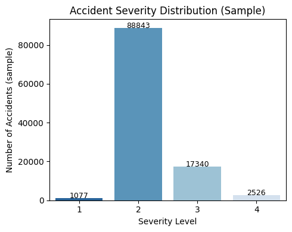
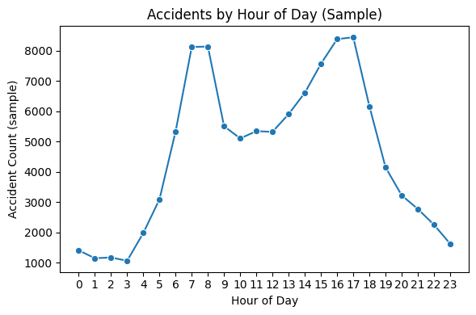
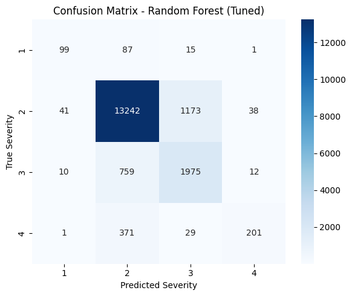
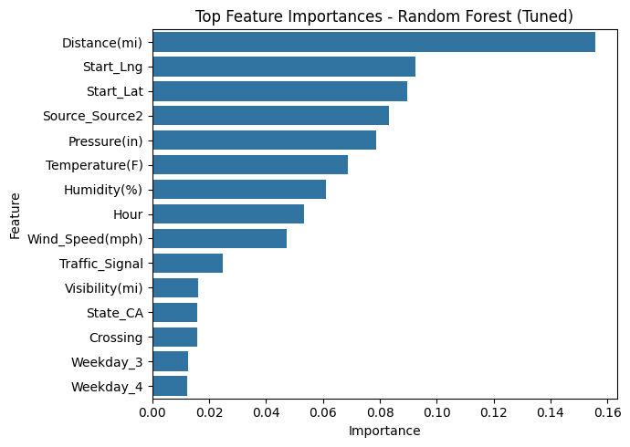
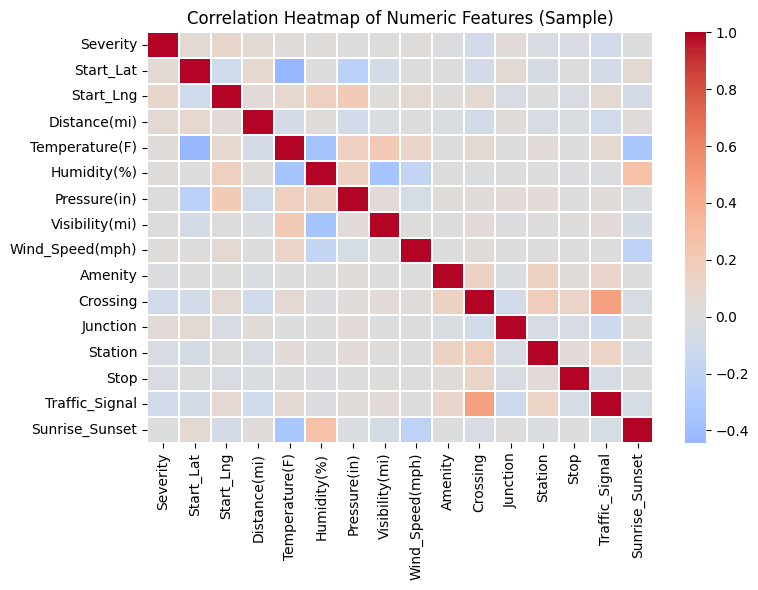
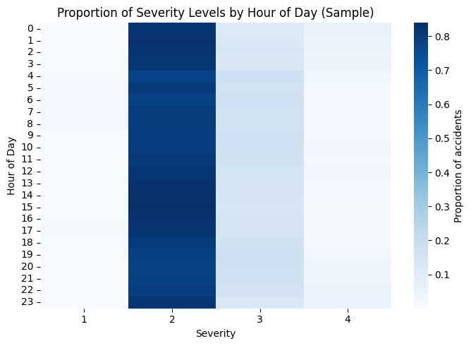

# Traffic Accident Severity Prediction

Predicting accident severity (1-4 scale) using the US Accidents dataset. Built this to see if we can identify conditions that lead to worse crashes—could be useful for route planning, emergency response, or just understanding what makes roads dangerous.

## Data

Using the Kaggle US Accidents dataset (2016-2023), which has 7.8M records. That's too big to load into memory, so I'm using DuckDB to query the CSV directly and pulled a 1% random sample (~110k records) for training.

**Class distribution is rough:**
- Severity 1: 1% 
- Severity 2: 81% (dominates everything)
- Severity 3: 16%
- Severity 4: 2%



Because of this imbalance, accuracy alone is misleading. I'm tracking macro-F1 and balanced accuracy instead.

## What's here

**Data handling**
- Download via Kaggle CLI
- Query with DuckDB (no need to load 7M rows into pandas)
- Random 1% sample for modeling

**EDA**
- Severity breakdown
- Accidents by time of day
- Top states (queried from full dataset)
- Yearly trends (also from full dataset)



**Preprocessing**
- Drop high-missingness columns and text fields
- Fill missing values where it makes sense
- Create time features (hour, weekday, day/night indicators)
- One-hot encode categoricals

**Models**

Started with baselines:
- Dummy classifier (always predict majority)
- Logistic regression
- Decision tree (depth=10)

Then tried ensembles:
- Random Forest with class weighting + RandomizedSearchCV
- XGBoost + RandomizedSearchCV

Both tuned on macro-F1 with 3-fold CV.

**Error analysis**
- Confusion matrices show models are good at Severity 2 (the majority class) but struggle with Severity 4
- Random Forest feature importance: time of day, weather visibility, and state are top predictors

## Results

### Baselines

| Model | Accuracy | Balanced Acc | Macro-F1 |
|---|---:|---:|---:|
| Dummy | 0.80 | 0.25 | 0.22 |
| Logistic | 0.82 | 0.31 | 0.32 |
| Decision Tree | 0.84 | 0.39 | 0.43 |

### Tuned models

| Model | Accuracy | Balanced Acc | Macro-F1 |
|---|---:|---:|---:|
| Random Forest | 0.86 | 0.61 | 0.65 |
| XGBoost | 0.87 | 0.52 | 0.59 |



XGBoost has slightly higher accuracy, but Random Forest does better on balanced accuracy and macro-F1. If you care about catching minority classes (Severity 1 and 4), Random Forest is the safer bet.

**Best CV scores (3-fold):**
- Random Forest: 0.609 macro-F1 (200 trees, no max depth, sqrt features)
- XGBoost: 0.559 macro-F1 (200 estimators, depth 6, lr 0.2)

## What I learned

- Severity is somewhat predictable, but rare events (Severity 4) are tough because there aren't many examples
- Both ensembles beat the baselines by a lot, especially on balanced metrics
- Models still under-predict Severity 4, often confusing it with 2 or 3. If missing severe accidents has a high real-world cost, you'd want to adjust thresholds or add more class weighting
- Time of day, weather conditions (visibility proxies), and location are the strongest signals



<details>
  <summary><b>More EDA (optional)</b></summary>

  <br/>
  Correlations among numeric features (sample) and severity proportions by hour-of-day.

  <br/>
  
  
</details>

## Running this

**Google Colab:**
1. Open notebook in Colab
2. Make sure you have Kaggle credentials set up (don't commit kaggle.json)
3. Run cells top to bottom

**Local:**
```bash
pip install -r requirements.txt
# Download dataset via Kaggle CLI or manually
# Run notebook
```

## Notes

This was a course project for Big Data Analytics (Fall 2025). The goal was to work with a large dataset and show we could handle the scale, not necessarily to build production-ready models. If I were doing this for real, I'd probably try:
- More sophisticated handling of class imbalance (SMOTE, cost-sensitive learning)
- Feature engineering around specific weather conditions or road types
- Temporal validation (train on older data, test on newer data)
- Geographic cross-validation (train on some states, test on others)

But for a semester project with limited time, this does what it needs to do.